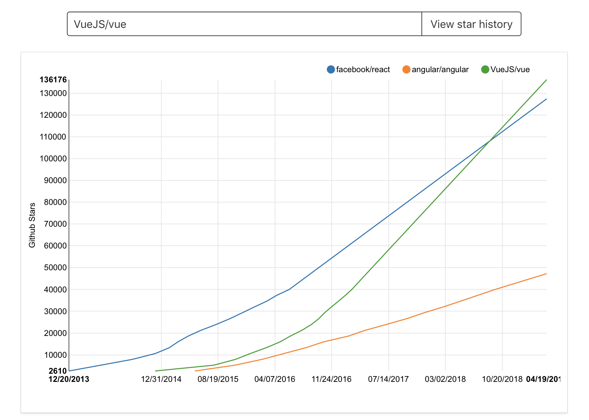

## Introduction

- R as the "data science" language 
- R as the backend
- R package plumber and ReactJS
- Enter geoplumber

---

## R for analysing data

- Why R? 
- "A second strong motivation for using R is its ability to interoperate with many other languages. Algorithms that have been written in another language seldom need to be reimplemented for use in R. Typically one need merely write a small amount of interface code and the routines can be accessed from within R (...). This approach also helps to ensure maximal code reuse." 

---

## R as the backend

- Few R packages, as we said, using other "system" libraries enable "http servers".
- HTTP requests (mainly GET and POST) with or without "web servers"

---

## R package plumber and ReactJS
- R package plumber is inspired by Python Flask: https://www.rplumber.io
- ReactJS is Facebook's JS library that powers Facebook frontend.
- Match made in Leeds? 

---

## Angular/React/VueJS

 
https://star-history.t9t.io/#facebook/react&angular/angular&VueJS/vue
---

## geoplumber

---
## References
- Gentleman, Robert. R programming for bioinformatics. Chapman and Hall/CRC, 2008

- Grinberg, Miguel. Flask web development: developing web applications with python. " O'Reilly Media, Inc.", 2018.

