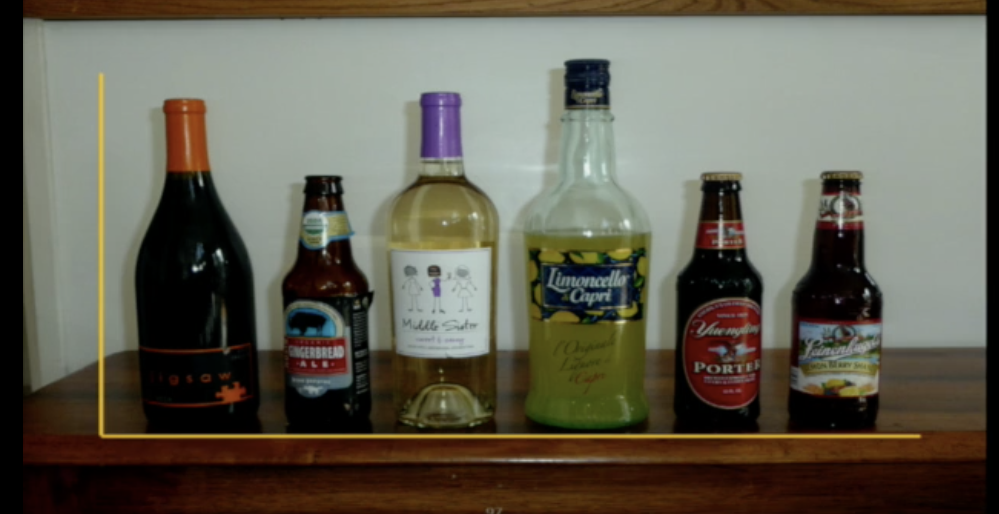

## Intro + Setup

This is a beginner session, if you feel you know the basics, jump to the reading list for something more useful. And it is focused on the tools and techniques more than the foundations and theoretical body of work on scientific/information visualization. Also, as we have only two hours, we will be spending maybe just minutes pointing to and referring you to the reading list below. Therefore we will spend the session discussion choices, libraries and of course examples of generating visualizations using R and R based wrapper packages for your projects and wider research work.

I think we all agree that:
- it would be hard to do any data analysis without charts
- even more difficult to communicate it without visualizing them
- as bonus, you could even get an audience moving with changing bars to tree maps, watch [John Stasko](https://en.wikipedia.org/wiki/John_Stasko)'s EuroVis capstone [talk](https://vimeo.com/98986594) if you have time to find out why. But be warned!

I think we all know the sad effect of "flatten the curve":


Getting started:

> Creating a visualization requires a number of nuanced judgments. One must determine which questions to ask, identify the appropriate data, and select effective visual encodings to map data values to graphical features such as position, size, shape, and color. 

~[@heer2010tour] 

So:

* ask a question
* prepare the data
* generate a chart

## Why R?
Feel free to go Python, I hope you will find nothing dogmatic for/against R. I think we discussed this in the Git/GitHub session but just in case.

- graphics is native
- data is native
- statistics is native

We have everything we need:
```{r plot-iris, eval=FALSE}
plot(iris[,1:4])
```

If you need datasets, remember one of the base packages in R is called `datasets`. You can discover the datasets in it in your own time (tip: try `library(help = "datasets")`). 

### BaseR
```{r showbaser}
rownames(installed.packages(priority="base"))
# rownames(installed.packages(priority="recommended"))
# stats, graphics etc
```

This is actually not the most basic R bar plot but OK we accept it:
```{r basicbarplot}
# create dummy data
d = data.frame(
  name=letters[1:5],
  value=sample(seq(4,15),5)
)
# barplot(height=d$value, names=d$name)
# this is the most basic R barplot
# barplot(height=d$value)
# or
# barplot(iris[1:10,1])
# with names
# barplot(iris[1:10,1], names=iris[1:10,5])
```

In base R, what I like is that there is no wrapper functions and just like other functions in base R, you get what you see:

```{r baser-xy}
set.seed(12)
# a boring example
height = sample(50:100, 10)
weight = sample(50:100, 10) 
# plot(height,weight)
# barplot(height, names = height)

```

and for histograms:
```{r base-hist}
set.seed(12)
n <- 100
x <- rchisq(n = n, df = 3) # n number, df = degrees of freedom
# hist(x = x, freq = FALSE, xlim = c(0, 15))
# lines(x = density(x = x), col = "red")
```

Sometimes it is useful to show error bars on graphs. To do this, we need to calculate standard deviations, I believe Excel or PSPP (alternative to SPSS) can do it from the column given. Though, this is where we leave it to the `ggplot2` to do the heavy lifting rather than doing it in base R.

Scatter plots
There is great support for visualizing data in base R, lets try some custom scatter plot:


Saving as files
```{r basepdf, eval=FALSE}
# pdf

pdf("~/Downloads/Sepal vs Petal Length in Iris.pdf")

plot(iris$Sepal.Length, iris$Petal.Length,
     col = iris$Species,
     main = "Sepal vs Petal Length in Iris", 
     xlab = "Sepal.Length",
     ylab = "Petal.Length")

dev.off()
```

### ggplot2

#### Hello Bar Chart
Lets start similarly with the most basic barplot:
```{r geombar}
library(ggplot2)
# p = ggplot(data = iris[1:10,], aes(x = Species, y = Sepal.Length)) +
#   geom_bar(stat='identity')
p = ggplot(diamonds, aes(cut)) +
  geom_bar(fill = "#0073C2FF")
# p
```

#### ggplot2 formula

```
ggplot(data = <DATA>) + 
  <GEOM_FUNCTION>(mapping = aes(<MAPPINGS>))
```
Remember this session should not be about `ggplot2`, otherwise I have missed my point. Having said that, the above needs some clarification:
- `data` is your data, work with columns, keep your rows for your "lines"
- `GEOM_FUNCTION` is a [variety](https://ggplot2.tidyverse.org/reference/), examples are `geom_bar`, `geom_histogram`
- crucailly the `mapping` variable is the crucial function [`aes`](https://ggplot2.tidyverse.org/reference/aes.html) or the fancy `Construct aesthetic mappings` expression.


#### Scatter plot
```{r init}
library(ggplot2)
p = ggplot(mpg, aes(displ, hwy, colour = class)) + 
  geom_point()
# p 
# or 
# ggplot(data = mpg) + 
#   geom_point(mapping = aes(x = displ, y = hwy, color = class))
```

We have seen or heard that ggplot2 can also do "smoothing". We can see a simple example from the code above
```{r smooth}
p = ggplot(data = mpg, mapping = aes(x = displ, y = hwy)) + 
  geom_point(mapping = aes(color = class)) + 
  geom_smooth()
# p
```

Notice the message given by the package making it clear what "method" and what "formulae" has been use dot generate the smoothing? Let's jump ahead by exploring the different methods that are used. The results are commented out on purpose.

```{r gridsmoothfunctions}
library(gridExtra)
plots = lapply(list("lm", "gam", "glm"), function(x){
  ggplot(mpg, aes(displ, hwy)) + 
  geom_point(mapping = aes(color = class)) + 
  geom_smooth(method = x)
}) 
# plots
# marrangeGrob(plots, nrow=2,ncol=2)
# ggsave("multiplot.pdf", ml)

```

#### Distribution

To overcome the overlapping points in the above scatter plots, we can use another function from `ggplot` check these examples from [here](http://r-statistics.co/Top50-Ggplot2-Visualizations-MasterList-R-Code.html):

```{r}
library(ggplot2)
theme_set(theme_classic()) # play with these? theme_bw()

# Histogram on a Categorical variable
p = ggplot(mpg, aes(manufacturer))
p = p + geom_bar(aes(fill=class), width = 0.5) + 
  theme(axis.text.x = element_text(angle=65, vjust=0.6)) + 
  labs(title="Histogram on Categorical Variable", 
       subtitle="Manufacturer across Vehicle Classes") 
# p
```

How about a density plot?
```{r densityplot}
library(ggplot2)
theme_set(theme_classic())

# Plot
p = ggplot(mpg, aes(cty))
p = p + geom_density(aes(fill=factor(cyl)), alpha=0.8) + 
    labs(title="Title: Density plot", 
         subtitle="Subtitle: City Mileage Grouped by Number of cylinders",
         caption="Caption: Source: mpg",
         x="City Mileage",
         fill="# Cylinders")
# p
```

Boxplots
I have great memories of Box plots, the reason is the type of studies I did during my PhD and maybe something special about Box plots in general too. For some reason someone has written an R package using Shiny and got themselves a space in "Correspondence" section in Nature [@spitzer2014boxplotr], I do think that is en overstatement though.

```{r boxplotiris}
p = ggplot(iris, aes(x = Species, y = Sepal.Length)) +
  geom_boxplot(width = 0.4, fill = "white") +
  geom_jitter(aes(color = Species), 
              width = 0.1, size = 1) +
  scale_color_manual(values = c("#00AFBB", "#E7B800", "#E7B8AF")) 
# p
```

#### Bars with errors

Rather than doing "fancy" visualization, as researchers we might actually need scientific information embedded in our work. So I think it is worth adding an example of bars with errors (staandard deviation?).

```{r ggplot2errorbars}
library(ggplot2)
library(dplyr)
# first we need a summary
iris.sum = iris %>% 
  group_by(Species) %>% # group
  summarise(mean_PL = mean(Petal.Length),  # Petal.Length mean for bars
            sd_PL = sd(Petal.Length), # Petal.Length sd
            n_PL = n(),  # just keeping the number of each group
            SE_PL = sd(Petal.Length)/sqrt(n())) # R gives us the SE too

p = ggplot(iris.sum, aes(Species, mean_PL)) + 
                   geom_col() +  
                   geom_errorbar(aes(ymin = mean_PL - sd_PL, ymax = mean_PL + sd_PL),
                                 width=0.2) +
  labs(y="Petal length (cm) ± s.d.", x = "Species") + theme_classic()
# p
```

## JS (web) 
I use React as my JS library (framework if you like) and the package I borrowed from Uber Eng is called ReactVis and that is what I use direclty. But in R, prominent and stable ones are "plotly" and I should mention Python's mighty Bokeh. The latter has of course an [interface](https://hafen.github.io/rbokeh/articles/rbokeh.html) in R called `rbokeh`.

So I will pick `plotly` although I fancy Bokeh more for this section. Shall we try a Box plot? Just because they too like to start with Box plot.

```{r plotlybox, eval=FALSE}
library(plotly)
p = plot_ly(iris, x = ~Sepal.Length, color = ~Species, type = "box")
# p
```


## Real data
Would be good to have a look at some real messy data if we have time or at least show code what is needed before we arrive at generating graphs. 

### US elections

Dataset - US Elections [@VN42MVDX_2017]
```{r, message=FALSE, eval=FALSE}
# get your csv from this link as we cannot link directly to the file
# https://dataverse.harvard.edu/dataset.xhtml?persistentId=doi:10.7910/DVN/42MVDX
d = read.csv("~/Desktop/data/us-elections/1976-2016-president.csv")
library(dplyr)
# names(d)
# head(d)
# Winner and runner up candidates
# dw = d[(d$candidatevotes/d$totalvotes) > .4, ]
d = d %>% select(state, year, party, candidatevotes, totalvotes) %>%
  mutate(percent = (candidatevotes/totalvotes) * 100)

# country wide percent
dc = d %>% group_by(year, party) %>%
  summarise(percent = sum(percent), n= n()) %>%
  mutate(percent = percent/n, n = NULL) %>% ungroup()
# head(dc)
# length(unique(dc$party))

# winning parties
dw = dc %>% filter(percent > 25)
# length(unique(dw$party))
# head(dw)

# add democratic-farmer-labor to democrat
# filter(dw, stringr::str_detect(party, "democratic-farmer-labor|democrat"))
# filter(dw, party == "democratic-farmer-labor")

# create new column to identify these two
dw$dems = stringr::str_detect(dw$party, "democratic-farmer-labor|democrat")
# dw
dw = dw %>% group_by(year, dems) %>%
  summarise(percent = sum(percent), n= n()) %>%
  mutate(percent = percent/n, n = NULL) %>%
  mutate(party = ifelse(dems, "democrat", "republican")) %>% # add back party
  mutate(dems = NULL)

# length(unique(dw$party))
dw$percent = format(round(dw$percent, 2), nsmall = 2)

library(ggplot2)

p = ggplot(dw, aes(x = factor(year), y = percent,
               fill = party)) +
  # define the colours for the parties
  geom_bar(stat = "identity", position = "dodge") +
  geom_text(aes(label=percent),
            position=position_dodge(width=0.9), vjust=-0.25) +
  scale_fill_manual("legend",
                    values = c("democrat" = "blue",
                               "republican" = "red"))
# p
```

### UK Road Saftey

This is an example from work we have done for `stats19` R package. We download accident data from DfT, do some joining and then plot a line with a smooth function:

```{r stats19, eval=FALSE}
library(stats19)
library(dplyr)
crashes = get_stats19(year = 2017, type = "accident", ask = FALSE)
casualties = get_stats19(year = 2017, type = "casualties", ask = FALSE)
crashes_wy = crashes[crashes$police_force == "West Yorkshire", ]
sel = casualties$accident_index %in% crashes_wy$accident_index
casualties_wy = casualties[sel, ]
cas_types = casualties_wy %>% 
  select(accident_index, casualty_type) %>% 
  mutate(n = 1) %>% 
  group_by(accident_index, casualty_type) %>% 
  summarise(n = sum(n)) %>% 
  tidyr::spread(casualty_type, n, fill = 0) 
cas_types$Total = rowSums(cas_types[-1])
cj = left_join(crashes_wy, cas_types, by = "accident_index")
# then group by dates
library(ggplot2)
crashes_dates = cj %>% 
  st_set_geometry(NULL) %>% 
  group_by(date) %>% 
  summarise(
    walking = sum(Pedestrian),
    cycling = sum(Cyclist),
    passenger = sum(`Car occupant`)
    ) %>% 
  tidyr::gather(mode, casualties, -date)
# finally
p = ggplot(crashes_dates, aes(date, casualties)) +
  geom_smooth(aes(colour = mode), method = "loess") +
  ylab("Casualties per day")
# p
```


If you like to know how visualization is used in every day work, feel free t6o discover these scrips which are part of our "SaferActive" project by our colleagues who are looking at finding patterns in change of road safety based on road safety interventions and cycling uptake in the UK.

- Trends in Local Authorities [example](https://github.com/saferactive/saferactive/blob/ca234078eba91a81f4bb79d0e46d7f67ad0460ca/code/la_trends.R)

- Another [example](https://github.com/saferactive/saferactive/blob/9760a0b4d0ea3b9572432c81cc549cfed689351d/code/dft-aadf-descriptive.R) from the same project.

## Reading List
- R for Data Science by H Wickham & G Grolemund Data Visualization [chapter](https://r4ds.had.co.nz/data-visualisation.html)
- Visualization analysis and design (Book) [@munzner2014visualization]
- ggplot2: elegant graphics for data analysis (Book) [@ggplo2]
- The eyes have it: a task by data type taxonomy for information visualizations [@shneiderman1996eyes]
- IEEVIS publications and conference.

## Watching List

- John Stasko: The Value of Visualization…and Why Interaction Matters, Eurovis Capstone Talk. https://vimeo.com/98986594

## More?
- See Roger's workshop materials on [github](http://www.roger-beecham.com/GEOG5042-data-visualization/index.html).

## References
