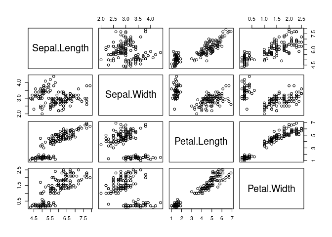

Data visualization
================
L Hama
2020-11-12

  - [Introduction](#introduction)
  - [Why R?](#why-r)
  - [Reading List](#reading-list)
  - [Watching List](#watching-list)
  - [References](#references)

## Introduction

## Why R?

``` r
plot(iris[,1:4])
```

<!-- -->

## Reading List

  - Visualization analysis and design (Book) (Munzner 2014)
  - ggplot2: elegant graphics for data analysis (Book) (Wickham 2016)
  - The eyes have it: a task by data type taxonomy for information
    visualizations (Shneiderman 1996)
  - IEEVIS publications and annual conference.

## Watching List

 - John Stasko: he Value of
Visualization…and Why Interaction Matters, Eurovis Capstone Talk.
<https://vimeo.com/98986594>

## References

<div id="refs" class="references hanging-indent">

<div id="ref-munzner2014visualization">

Munzner, Tamara. 2014. *Visualization Analysis and Design*. CRC press.

</div>

<div id="ref-shneiderman1996eyes">

Shneiderman, Ben. 1996. “The Eyes Have It: A Task by Data Type Taxonomy
for Information Visualizations.” In *Proceedings 1996 Ieee Symposium on
Visual Languages*, 336–43. IEEE.

</div>

<div id="ref-ggplo2">

Wickham, Hadley. 2016. *Ggplot2: Elegant Graphics for Data Analysis*.
springer.

</div>

</div>
