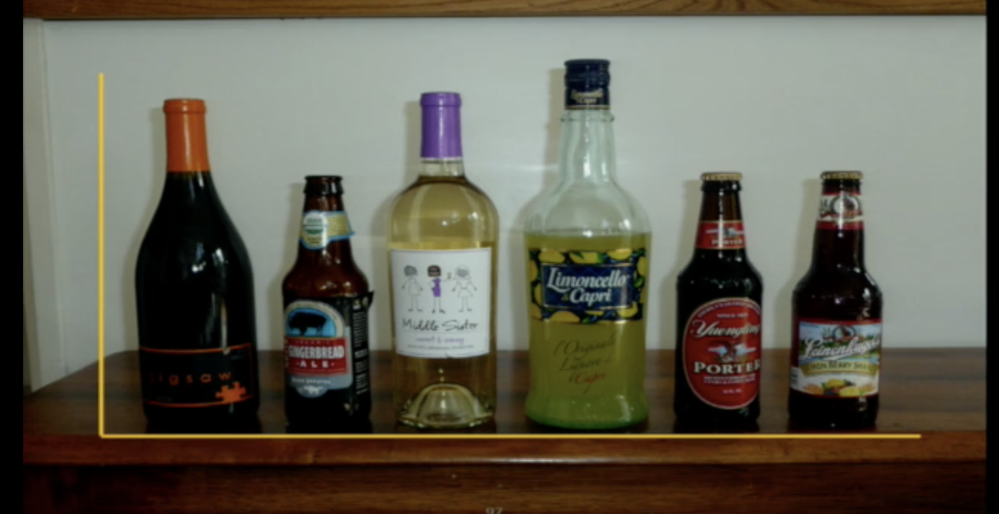

Data visualization
================
L Hama
2020-11-17

  - [Introduction](#introduction)
  - [Why R?](#why-r)
  - [Reading List](#reading-list)
  - [Watching List](#watching-list)
  - [More?](#more)
  - [References](#references)

## Introduction

This session will be focused on the tools and techniques more than the
foundations and theoretical body of work on scientific/information
visualization. And as we have only two hours, we will be spending maybe
just minutes pointing to and referring you to the reading list below.
Therefore we will spend the session discussion choices, libraries and of
course examples of generating visualizations using R and R based wrapper
packages for your projects and wider research outputs.

## Why R?

``` r
plot(iris[,1:4])
```

<!-- -->

## Reading List

  - Visualization analysis and design (Book) (Munzner 2014)
  - ggplot2: elegant graphics for data analysis (Book) (Wickham 2016)
  - The eyes have it: a task by data type taxonomy for information
    visualizations (Shneiderman 1996)
  - IEEVIS publications and annual conference.

## Watching List

 - John Stasko: he Value of
Visualization…and Why Interaction Matters, Eurovis Capstone Talk.
<https://vimeo.com/98986594>

## More?

  - See Roger’s workshop materials on
    [github](http://www.roger-beecham.com/GEOG5042-data-visualization/index.html).

## References

<div id="refs" class="references">

<div id="ref-munzner2014visualization">

Munzner, Tamara. 2014. *Visualization Analysis and Design*. CRC press.

</div>

<div id="ref-shneiderman1996eyes">

Shneiderman, Ben. 1996. “The Eyes Have It: A Task by Data Type Taxonomy
for Information Visualizations.” In *Proceedings 1996 Ieee Symposium on
Visual Languages*, 336–43. IEEE.

</div>

<div id="ref-ggplo2">

Wickham, Hadley. 2016. *Ggplot2: Elegant Graphics for Data Analysis*.
springer.

</div>

</div>
