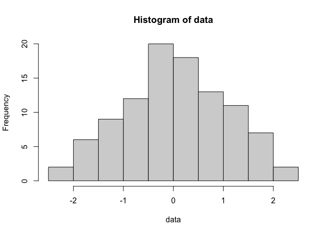

Code Sharing and Reproducible Research
================
L Hama
2020-09-26

  - [Code sharing for
    reproducibility](#code-sharing-for-reproducibility)
  - [Environment based](#environment-based)
  - [Automation and Continous
    Integration](#automation-and-continous-integration)
  - [Publishing](#publishing)
  - [References](#references)

This is a 30 minutes interactive session on MS Teams at
[LIDA](https://lida.leeds.ac.uk) where I am based.This README is there
to help attendees find resources discussed and others who land here.

Why?

> The replication of scientific findings using independent investigators
> … the standard by which scientific claims are evaluated. (Peng 2009)

I think there is also the “Open Source” ethos of work involved as well
as the scientific method. Without the underlying tools being open
source, it would be rather difficult to reproduce the results 100%.

Who does this? *Biostatistics*

> The policy was implemented in July 2009, and as of July 2011, 21 of
> 125 articles have been published with a kite-mark, including five
> articles with an “R.” (Peng 2011)

### Code sharing for reproducibility

Version Control System (Wikipedia
[entry](https://en.wikipedia.org/wiki/Version_control)) is the subject
name for tracking source code versioning and also to collaborate
remotely. Git is just one of few but perhaps the best. One of the two
major contributions from Linus Torvalds.

Git is a great tool if not the standard tool for sharing code. However,
as far as I know, there is not a convention or established method for
formatting or structuring our research outputs. Whilst writing this I
came across [this
effort](http://drivendata.github.io/cookiecutter-data-science/) and I
think they know what I am talking about. Before code sharing platforms I
think people may have used www.sourceforge.net to dump source code or in
the case of theses, maybe submit zip files.

### Environment based

The tools and techniques to share code is based on the language. In this
context the two major languages as you know are Python and R (or R and
Python).

In Python, an interactive document which works in browsers and supports
Julia, Python and R is called “Jupyter” from those names. Though it also
can support
[quite](https://github.com/jupyter/jupyter/wiki/Jupyter-kernels) a lot
of other languages using what is called Jupyter “kernel”s.

I just want to play with one: - try Google’s Colab (need gmail account)
<http://colab.research.google.com/#create=true> - Kaggle:
<https://www.kaggle.com/notebooks> - many more\!

In R, [Rmarkdown](https://github.com/rstudio/rmarkdown) is the widely
used package and document format of generating “interactive” (note quite
like Jupyter) to generate documents that can be “rendered” and reproduce
the research carried out.

  - CoCalc
    [here](https://cocalc.com/projects/ec4696eb-d91a-4d9a-bf21-90ce5f03914b/files/Welcome%20to%20CoCalc.ipynb?session=default)


Generate the same here in rmarkdown:

``` r
data <- rnorm(100)
summary(data)
```

    ##    Min. 1st Qu.  Median    Mean 3rd Qu.    Max. 
    ## -2.7205 -0.5416  0.2695  0.1690  0.8481  2.4289

``` r
hist(data)
```



This very README file itself, is a reproducible document. The following
screenshot is from MS Visual Studio Code Rmd rendered and previewed
simultaneously. Also, sent to the GH pages of my personal account.


### Automation and Continous Integration

Why?

> Each integration is verified by an automated build (including test) to
> detect integration errors as quickly as possible.(Fowler and Foemmel
> 2006)

There is an emerging picture here, as we more and more integrate
computation into our lives and specifically into scientific research we
also integrate computing tools and techniques into our workflow.

GitHub, GitLab, BitBucket and others include tools to run build tasks.
Travis is perhaps the best known platform for running build tasks with
Jenkins being a leading open source tool that can do what Travis does.

Once code/research output has been generated and pushed by collaborating
individuals/teams, it is critical to findout if there are any errors.
This is the job of “continous integration” (CI).

So for example writing almost any package in any programming language is
supported by Travis and more cently GH actions.

### Publishing

There are great tools which assist with self publishing just like this
very RMD (md) document which is hosted on github.io for free as it is a
public repo. Thanks to tools like
[Jekyll](https://github.com/jekyll/jekyll) and
[Hugo](https://github.com/gohugoio/hugo), all kinds of content can be
published including under own “domain names” such as www.layik.me (does
not exist)

So here is a list of awesomes for data science, code shareing, CI and
more:

  - [data science](https://github.com/academic/awesome-datascience)
  - jupyter
  - rmarkdown
  - 
### References

<div id="refs" class="references hanging-indent">

<div id="ref-fowler2006continuous">

Fowler, Martin, and Matthew Foemmel. 2006. “Continuous Integration.”

</div>

<div id="ref-peng2009reproducible">

Peng, Roger D. 2009. “Reproducible Research and Biostatistics.”
*Biostatistics* 10 (3): 405–8.

</div>

<div id="ref-Peng1226">

Peng, Roger D. 2011. “Reproducible Research in Computational Science.”
*Science* 334 (6060): 1226–7. <https://doi.org/10.1126/science.1213847>.

</div>

</div>
